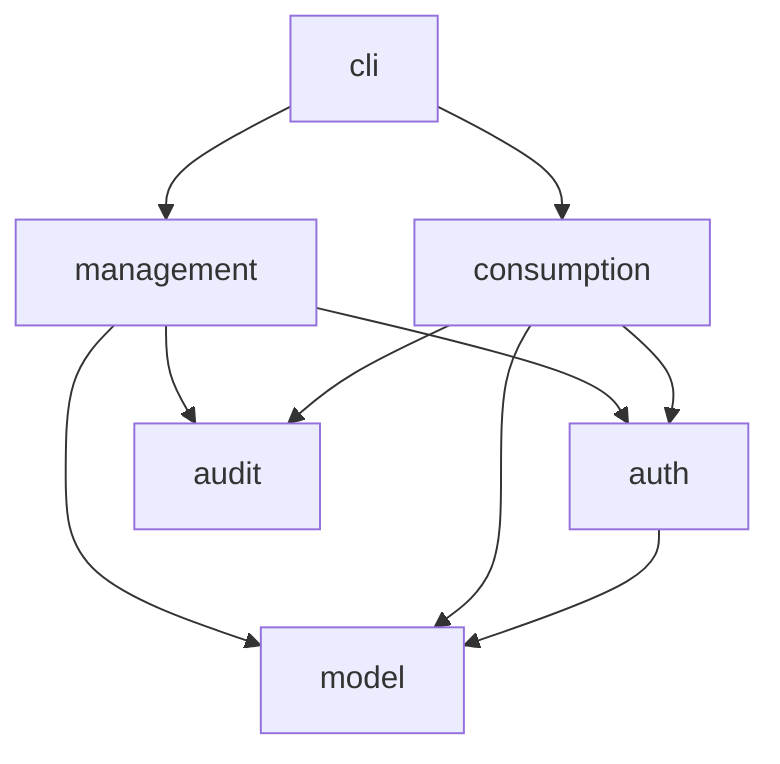

# Digital ID Backend

A console-based backend platform for issuing, managing, and verifying digital identity documents across multiple organisation types.


## Overview

The platform models a centralised digital identity system where a single authority controls the full lifecycle of citizen identity records — creating them, updating their details, and changing their status. 
External organisations such as tax authorities, employers, banks, and driving licence authorities can each perform a narrow, role-specific set of read-only verification checks against those records. 
All operations, whether permitted or rejected, are captured in an immutable audit log.

## Architecture



## Package Structure

**`com.digitalid.model`**: Core domain entities. Contains `DigitalId` (built via a builder, immutable after creation except through `DigitalIdMutator`), `StatusEntry` (an append-only record of each status change), and the `DigitalIdStatus` and `OrganisationType` enums.

**`com.digitalid.management`**: Identity lifecycle operations. The `IdentityManager` interface and its implementation handle creating identities and updating their address, email, temporary restriction flag, and status (suspend, reactivate, revoke). Only the central authority uses this layer.

**`com.digitalid.consumption`**: Verification services for external organisations. The `IdentityConsumptionService` interface exposes three targeted checks — validity, tax eligibility, and licence eligibility — each returning a `VerificationResponse` that includes a human-readable reason.

**`com.digitalid.auth`**: Organisation-level authorisation. `AuthorisationManager` enforces a fixed permission matrix keyed by `OrganisationType`; any request outside a caller's permitted operations throws `UnauthorisedOperationException`. The `Operations` class holds all operation name constants.

**`com.digitalid.audit`**: Audit logging. `AuditLogger` records every operation attempted through the platform — success or failure, with organisation type, operation name, associated identity ID, and a details string. `InMemoryAuditLogger` backs the log with an unmodifiable-wrapped `ArrayList`.

**`com.digitalid.cli`**: Console entry point. The `Cli` class drives an interactive menu that exposes all management and consumption operations, routes input to the correct service instance, and prints the audit log on demand.

## How to Run

**Prerequisites:** Java 17, Maven 3.x

```bash 
# Run the interactive CLI
mvn compile exec:java
```

## Running the Tests

The test suite includes 98 JUnit 5 tests: 81 unit tests covering each layer in isolation: model, management, consumption, authorisation, and audit. 
The other 17 tests are integration tests that exercise the full request lifecycle across all layers working together.

```bash
mvn test
```
